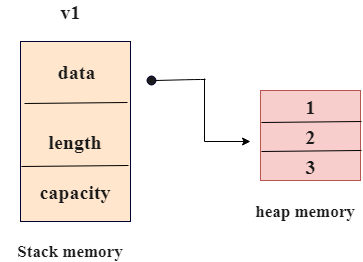
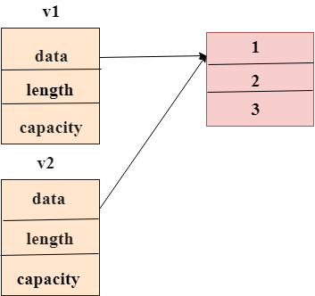

# learn-rust  

## Book
- https://rust-lang.github.io/rustc-guide/about-this-guide.html rust官方指南
- http://wiki.jikexueyuan.com/project/rust-primer/quickstart/primitive-type.html  极客学院的rust教程
- https://doc.rust-lang.org/std/primitive.f64.html rust 函数库
- https://doc.rust-lang.org/rust-by-example/index.html rust example
- https://rust-lang.github.io/rfcs/ rust rfcs

## 疑问
- 如何if == string？

- while循环和for循环的区别：
> 如果数组的索引长度在运行时增加，那么while循环显示错误，但在for循环的情况下不会发生这种情况。 因此，可以说for循环增加了代码的安全性并消除了错误的可能性。

- 为什么要加!

- 使用前，需要将变量声明，不存在js类似的变量提升

- i32表示多少 
- 不能打印长元组？？ 报错,WHY?
```rust
fn main(){
   let too_long_tuple=(1,65,56,6,565,65,95,5,655,656,64,65,5,61,6,5656);
   println!("too long tuple:{:?}",too_long_tuple);
}
```
- rust 如何执行一段函数返回的代码，即函数返回值
```rust

/*
* @pair 入参一个，内含两个元素，数据类型为(i32，bool)元组
* @return 返回值为 数据类型为，也是个元组 (bool,i32)
*/
fn reverse(pair:(i32,bool))->(bool,i32){
	let (integer,boolean)=pair;
	(boolean,integer)
}
fn main(){
	let pair = (11,true);
	println!("{:?}",reverse(pair));	
}

```

- rust 如何计算一个函数加值的运算，涉及到 ：入参、返回值，类型

```rust
fn main(){
	println!("{}",fool(999));
}
fn fool(num:i32)->(i32){
	return num+999; // 或者num+999，不需要return
}

```

- 为什么要加一个&?

```rust
use std::mem;
fn analyze_slice(slice:&[i32]){
	println!("第一个元素：{}",slice[0]);
	println!("数组的长度：{}",slice.len());
}

fn main(){
	let xs:[i32;5]=[9898,9856,685659,66,9];
	analyze_slice(&xs)//为什么要加一个&呢？	
}
```


- match在函数中的作用
```rust
fn inspect(event:WebEvent){
    // match干嘛的？
    match event {
        WebEvent::PageLoad=>println!("page load"),
        WebEvent::PageUnload=>println!("page unload"),
        WebEvent::Keypress(c)=>println!("pressed '{}'.",c),
        WebEvent::Paste(s)=>println!("pasted\"{}\".",s),
        WebEvent::Click {x,y}=>println!("click at x={},y={}",x,y)
    }
}
```

- 怎么打印枚举
```rust
enum Point{
	x = 111
}
println!("{}");

```
## structures 结构


rust 通过自定义类型主要通过以下两个关键形成：
- struct 声明一个结构
- enum   声明一个枚举

常量可以通过`const` `static`  关键字声明

结构：
- 元组结构，基本上是命名为元组的。
- 经典的C结构
- 无字段的单元结构对于泛型很有用


- rust 的结构和解构
```rust
struct Pair(i32,f32);
struct Person<'a> {
    name: &'a str,
    //这是啥子？
    age: u8,
}
 fn main(){
 	  let pair =Pair(99,99.99);
 	  let Pair{x,y}=pair;
 	  println!("{:?}\n{:?}",x,y);
 	  
 	   let name = "Jogel";
      let age = 27;
      let jogel = Person { name, age };
      
      println!("{:?}",jogel);
 }
```    

- 如何跨文件使用use    
```rust

enum Status{
    Rich,
    Poor
}
enum Work{
    Google,
    Microsoft,
}

use Status::{Poor,Rich};

use Work::*;

```


## 内存和分配

;

- 堆栈存储器
	- 循环放置
	- 相反顺序移除
	- 遵从`后进先出`，进电梯 原则
	- 始终 首先删除最后插入的数据
	- `堆栈内存`有组织的内存，比`堆内存`更快
	- 访问内存的方式
	- 编译时数据大小未知，则`堆内存`用于存储内容

- 堆内存
	- `堆内存`是有组织的内存	
	- os 在`堆内存`中找到一个空的空格并返回一个指针，这叫 `在对上分配`

;

- 第一步
	- 向量v1与值 1 2 3 '666'绑定，四个部分组成
	- 指向存储器中指向存储在内存的数据的指针 长度和向量的容量
	- 这部分存储在堆栈中，二数据存储在堆内存中

;

- 第二步
	- `v1` 向量分配给向量`v2`
	- 指针，长度、容量将复制到堆栈中
	- 但不会讲数据复制到堆内存中 
	- 
	- `v1`、`v2` 都超出范围时，两者都会尝试释放内存
	- 这会导致双重空闲内存，从而使得内存损坏~
	
;

- 第三步
	- rust 避免了第二步的内存问题
	- rust没有复制分配的内存，则认为`v1`向量不再有效
	- 当 `v1`超出范围时，它不需要释放`v1`的内存
	
;

```rust
fn main(){
	let v1= vec![1,2,3,"666"];
    let v2 = v2;
}

```

### 特征复制
- 复制特征是特殊的注释
- 放在存储堆栈上的整数类型上
- 如果类型使用了复制特征，则复制之后还可以使用旧变量
- 复制类型
	- 所有整数类型，如 `u32`
	- 布尔类型 `bool`:`true`, `false`
	- 所有浮动类型，如`f64`
	- 字符类型，如 `char`


### 所有权和函数

## 常识

|name|desc||
|---|---|---|
|.rs|rust文件后缀||
|Cargo.lock|||
|Cargo.toml|||
|xxx.iml|||
|src目录|源码||
|target目录|||
|mnt i| i是可以更改变量，可变变量||
|双引号|给字符/对象||
|str|String::from("a string")||
|char|`a`，单引号是一个单字符，超出则编译错误 `let char = 'a'`||
|&str|`abd`，双引号括住是多个字符 `let a="你好"`||
|return None|||
|return true|||
|return false|||
|return Err(err)|||
|impl|||
|符号整数|i开头||
|无符号整数|u开头，不是负号||
|#[derive(Debug)]|||
|#[allow(dead_code)]|||
|{:?}|打印数组、元组||
|match|rust关键字提供匹配模式，类似C的 `switch`|参考https://doc.rust-lang.org/rust-by-example/flow_control/match.html|
|_|下划线|_=>print!("xx"),类似如果下划线在match中，类似switch 的default:|
||||
||||
||||
||||
## install
### version
> rustc --version
### update 更新
> rustup update
### uninstall 下载
> rustup self uninstall
## rustup

## cargo

## 第一个程序

```rust
fn main(){
    print!("Hello,world!");
}
```


执行命令
> rustc hello.rs 

会生成` hello.exe`、`hello.pdb`，windows 下运行hello.exe才会运行

## 函数
|函数|解释|demo|
|format!()|格式化文本写入字符串||
|print!|类似format!，但打印到控制台||
|println!()类似print!但会添加新的一行|||
|eprint!|类型format!，打印为标准错误||
|eprintln!()类似eprint，但会添加新的一行|||
||||
||||
||||


### print!()  
- print!(双引号)，且只能是字符串

```rust
fn main(){
    let a=9;
    if  a==9 {
        print!("aaa");
    }
}
```

### println!()

## if判断语句
```rust
fn main(){
    let a=9;
    if  a==8 {
        println!("aaa");
    }
    else if a>8 {
        println!("bbb");
    }
    else{
        println!("ccc");
    }
}
```
## if in a let语句

## error
- https://doc.rust-lang.org/error-index.html#E0308  rust编译错误索引

> expected integer, found char

> too many characters in char literal  表示只能是单个字符！！a或者b，不能ab

> String::from("S/\q\t\nI}POYY<M?>?M>NM>M<JKLKL:KLII/\dh") \d这里有问题


## 循环
### loop 循环
- 需要mnt 声明变量，
- 无法使用i++ 自增加1，而是i+=1
- break 跳出loop
```rust
fn main(){
	let mut i =1;
    loop {
        println!("{}",i);
        if i==10{
            break
        }
        i+=1
    }
}

```
### for循环

- 循环数组
```rust
//TODO 循环数组
fn main(){
	let res =["mango","apple","banana","litchi","watermelon"];
    for i in res.iter() { //iter()方法
            println!("{}",i)
    }
}
```

- 循环对象
```rust
//TODO 循环对象
```
### while循环
- 索引不正确，循环有问题
- 每次迭代前进行条件检查，速度慢
- 如果外部引发条件变化，则可能会引发死循环的异常
```rust
fn main(){
	let mut i=0;
    while i<=10 {
        println!("{}",i);
        i+=1
    }
}
```
## 数组

### 访问方式 和js 一样 arr[1]

## 方法
### .to_owned()
### .iter()

### match  类似 `switch`
```rust
fn main(){
	let number=1;
    println!("the number:{}",number);
    // prime
    match number {
        1=>println!("One"),
        2=>println!("Two"),
        3|4|5|6|7|11=>println!("匹配的数字"),
        12...19=>println!("A ten哇"),
        // 不是特殊的
        _=>println!("default"),
    }
    let boolean =true;
    let binary =match boolean
        {
            false=>0,
            true=>1
        };
    println!("{}-{}",boolean,binary);
}

```
- 访问数组的每个元素


## 所有权

- 代码块拥有资源时，被称为所有权。
- 代码块创建一个包含资源的对象。
- 当控件到达末尾时，对象将被销毁，资源将被释放
- Rust中，每个值都有一个与之关联的变量，并成为其所有者
- 一次只能有一个所有者
- 当所有者超出范围是，与其关联的值将被销毁

> a被回收，编译直接报错
```rust
// 
fn main(){
	let a =20;
    let b = a;
    println!("{}",a)
}
```

>但是 下面这样就不会被回收~~ TODO ？why？
```rust
fn main1(){
	let a =20;
    let b = a;
    println!("{}",b);
    println!("{}",a)
}
```


### 所有权和函数
```rust
fn main(){
	let s =String::from("SDUSAJDOISAJ IUJODSJAI ");//啥意思？
    take_ownership(s);
    let ch ='a';
    move_copy(ch);
    println!("main:{}",ch)
}
fn take_ownership(str:String){
    println!("take_ownership:{}",str)
}
fn move_copy(c:char){
    println!("move_copy:{}",c)
}
```
- 

## 字符
```rust
fn main(){
	let ch = 'a';
    //let tt = 'abad';//为啥这里会报错，因为char 类型只能是一个字符
    move_copy(ch);
    move_copy(tt);
}
	
fn move_copy(str:String){
	println!("{}",str)
}

```

### 存放任意字符，斜杠之类的
> \d \q都有问题

>let s =String::from("S/\q\t\nI}POYY<M?>?M>NM>M<JKLKL:KLII//\dh");


## 数据类型

|类型 |值  |
|----|----|
|布尔类型|`true` `false`|
|字符类型|单个Unicode类型，存储4个字节|
|数值类型-符号整数|`i8` `i16` `i32` `i64` `isize`|  
|数值类型-无符号整数|`u8` `u16` `u32` `u64` `usize`|
|数值类型-浮点数|`f32` `f64`|
|字符串类型-底层不定长类型|`str`|
|字符串类型-字符串切片|`&str`，静态分配，固定大小，不可变|
|字符串类型-堆分配字符串|`String`，可变|
|数组|固定大小，且元素都同类型，`[T;N]`|
|切片|引用一个数组的部分数据，并且不需要拷贝,`&[T]`|
|元组|固定大小的有序列表，元素都有自己的类型，通过解构或者索引来获取值|
|指针|最底层的裸指针,`*const T` `*mut T`,但解引用它们是不安全的，必须放到`unsafe`块里|
|函数|具有函数类型的变量实质上是一个函数指针|
|元类型|即`()`，其唯一值也是`()`|

### 数字转为其他类型

## rustup

Command                                                     | Description
----------------------------------------------------------- | ------------------------------------------------------------
`rustup default nightly`                                    | Set the default toolchain to the latest nightly
`rustup target list`                                        | List all available targets for the active toolchain
`rustup target add arm-linux-androideabi`                   | Install the Android target
`rustup target remove arm-linux-androideabi`                | Remove the Android target
`rustup run nightly rustc foo.rs`                           | Run the nightly regardless of the active toolchain
`rustc +nightly foo.rs`                                     | Shorthand way to run a nightly compiler
`rustup run nightly bash`                                   | Run a shell configured for the nightly compiler
`rustup default stable-msvc`                                | On Windows, use the MSVC toolchain instead of GNU
`rustup override set nightly-2015-04-01`                    | For the current directory, use a nightly from a specific date
`rustup toolchain link my-toolchain "C:\RustInstallation"`  | Install a custom toolchain by symlinking an existing installation
`rustup show`                                               | Show which toolchain will be used in the current directory
`rustup toolchain uninstall nightly`                        | Uninstall a given toolchain
`rustup toolchain help`                                     | Show the `help` page for a subcommand (like `toolchain`)
`rustup man cargo`                                          | \(*Unix only*\) View the man page for a given command (like `cargo`)


